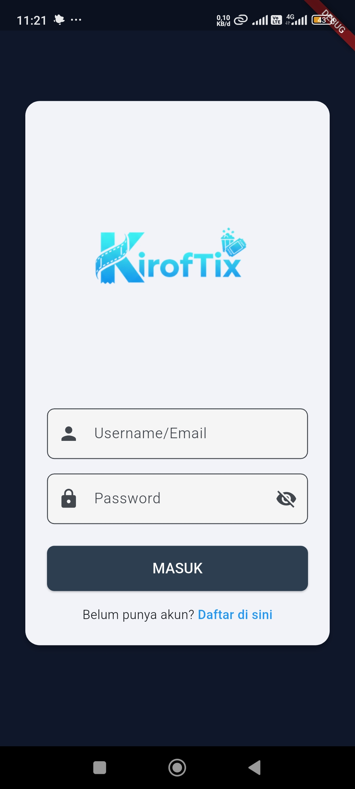
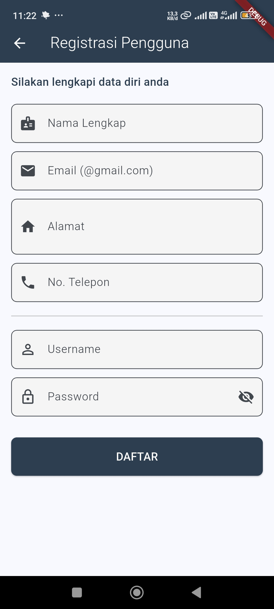
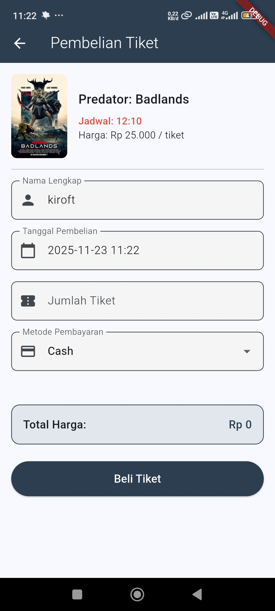
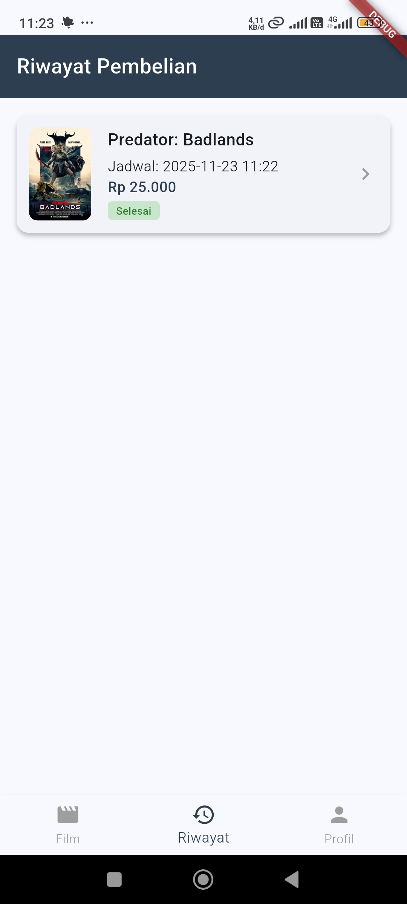
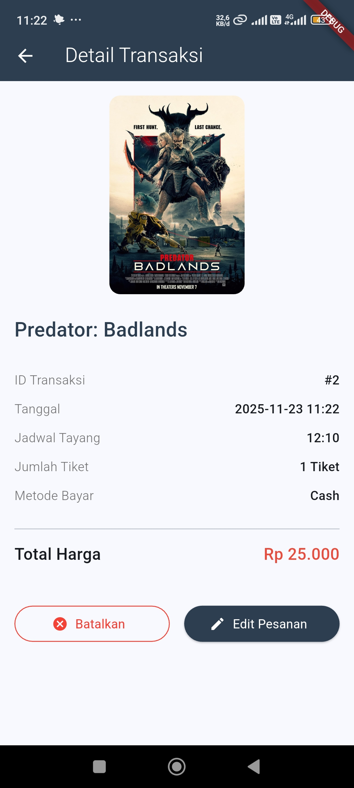
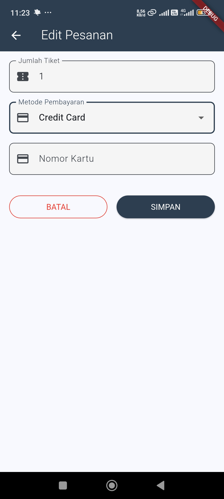
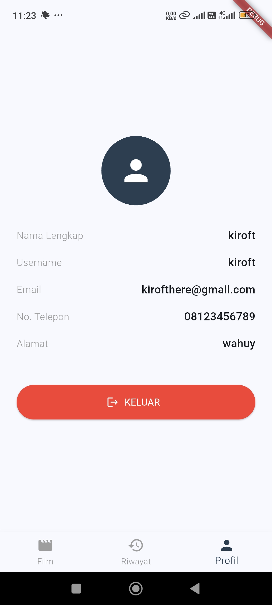

# KirofTix - Aplikasi Pemesanan Tiket Bioskop
### UTS Mata Kuliah Pengembangan Aplikasi Mobile
### Muhammad Rafii Firdaus 
### NIM 3012310024

## Tentang Aplikasi
KirofTix adalah aplikasi mobile yang memungkinkan pengguna untuk melihat daftar film yang sedang tayang, melihat jadwal, membeli tiket, serta mengelola riwayat transaksi pembelian. Aplikasi ini dirancang untuk memenuhi standar tugas kuliah dengan implementasi CRUD (Create, Read, Update, Delete) menggunakan database lokal.

## Fitur Utama
Sesuai dengan spesifikasi perancangan sistem:
#### 1. Autentikasi Pengguna
- Login: Validasi username/email dan password. Mencegah akses tanpa akun.
- Registrasi: Pendaftaran akun baru dengan validasi input (Email format @gmail.com, Password min. 6 karakter, No. Telepon angka). Cek duplikasi username/email secara otomatis.
- Logout: Menghapus sesi dan kembali ke halaman login tanpa bisa kembali (stack clear).

#### 2. Halaman Utama (Dashboard)
- Menampilkan informasi pengguna yang sedang login.
- Daftar film yang sedang tayang (List View) lengkap dengan poster, genre, harga, dan pilihan jadwal.

#### 3. Transaksi Pembelian
- Formulir Pembelian: Otomatis mengisi data film dan jadwal.
- Kalkulasi Real-time: Total harga otomatis terhitung saat jumlah tiket diubah.
- Metode Pembayaran: Pilihan Cash, Kartu Debit, atau Kartu Kredit (Validasi input 16 digit jika memilih kartu).

#### 4. Manajemen Riwayat (CRUD)
- Lihat Riwayat: Menampilkan daftar transaksi yang pernah dilakukan user.
- Detail Transaksi: Melihat rincian lengkap tiket, termasuk sensor nomor kartu kredit (****).
- Edit Pesanan: Mengubah jumlah tiket atau metode pembayaran pada transaksi yang sudah ada.
- Batalkan Transaksi: Menghapus transaksi dari database (Fitur Cancel).

## Teknologi yang Digunakan
- Framework: Flutter 3.35.5
- Bahasa Pemrograman: Dart
- Database Lokal: sqflite
- Format Data: intl (untuk format rupiah dan tanggal)
- Path Provider: path

## Screenshots
- Halaman Login
####  
- Halaman Registrasi
####  
- Halaman Utama
####  
- Halaman Pembelian Tiket
####  
- Halaman Riwayat Pembelian
####  
- Halaman Detail Transaksi
####  
- Halaman Edit Pesanan
####  
- Halaman Profil Pengguna
####  

## Link Video Pengetesan
https://drive.google.com/file/d/11lK4W1_hm6mSww27uxPjqiTpch6wqSZb/view?usp=sharing 

